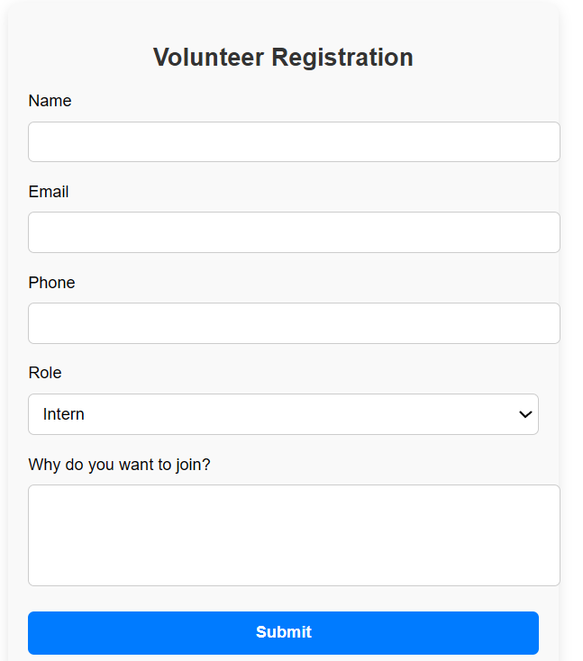
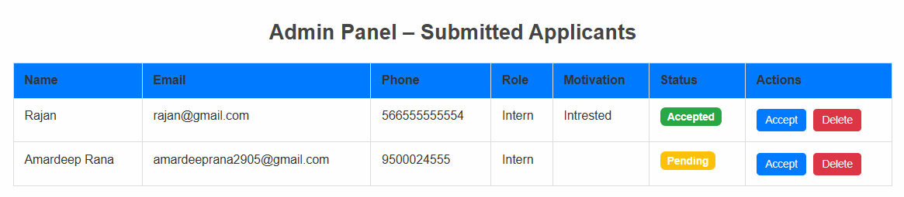

# BKP Internship Web App

A responsive full-stack web application built for the **Basti Ki Pathshala Foundation** to manage **Intern/Volunteer registration** and provide an **Admin Dashboard** to view submissions.

🔗 **Live Demo:** [https://bkp-internship.netlify.app](https://bkp-internship.netlify.app)

---

## 📌 Features

- 🏠 Home page with introduction
- 📝 Volunteer/Intern registration form
- 📤 Saves data to **Firebase Firestore**
- 📋 Admin panel to view submitted entries
- 📱 Fully responsive and user-friendly interface
- 🚀 Deployed using **Netlify**

---

## 🛠️ Tech Stack

| Frontend | Backend           | Hosting  |
|----------|-------------------|----------|
| React.js | Firebase Firestore | Netlify  |

---

## 📷 Screenshots

### 📝 Registration Form


### 📋 Admin Dashboard


---

## 🚀 How to Run Locally

```bash
git clone https://github.com/amardeeprana29/bkp-internship-app
cd bkp-internship-app
npm install
npm start
